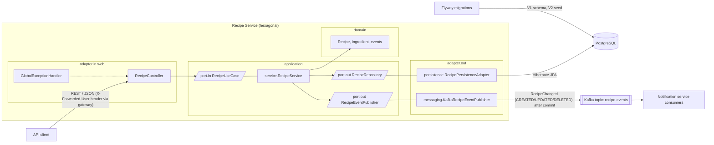
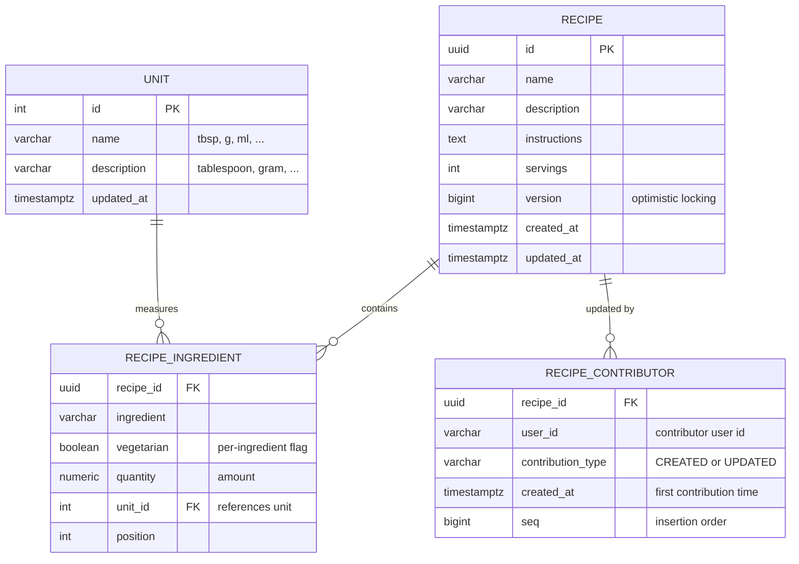
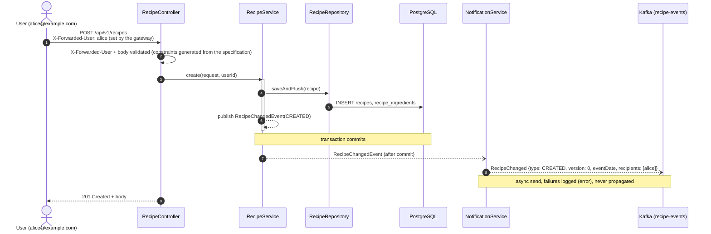
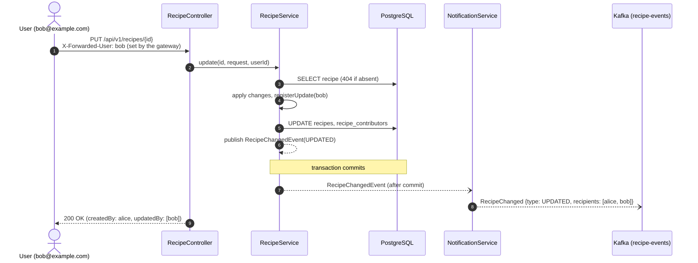
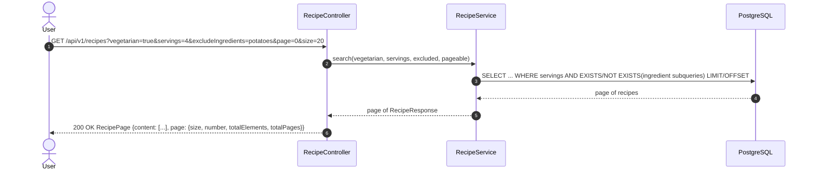

# Recipe Service - Architecture

## Overview

The recipe service is a Spring Boot 4 (Java 25) application exposing a REST API for managing
recipes. Data is persisted in PostgreSQL via Hibernate/Jakarta Persistence (JPA); the schema and seed data
(10 recipes) are managed by Flyway migrations that run on startup.

The API is **specification-first**: `src/main/resources/static/openapi/recipe-api.yaml` is the single source of
truth. The `openapi-generator-maven-plugin` generates the `RecipesApi` interface and all data transfer objects (DTOs)
(`RecipeRequest`, `RecipeResponse`, `RecipePage`, …) at build time, and `RecipeController`
implements the generated interface. Contributor notifications are published asynchronously to a
Kafka topic as a single `RecipeChanged` event with type `CREATED`, `UPDATED` or `DELETED`.
Each event carries the recipe's post-change `version`, so consumers can re-order events that
arrive out of commit order (the exact consumer rule is documented on the `RecipeChanged`
wire record).

**Security is out of scope for this service**: authentication and authorization are the
responsibility of an API gateway deployed in front of it. The gateway authenticates the caller
and forwards the user's id in the mandatory `X-Forwarded-User` header, which the service trusts.

The codebase follows **hexagonal architecture** (ports & adapters). The domain is the isolated
core - free of web, persistence and messaging concerns - and dependency direction is enforced
with ArchUnit tests. All layer-boundary mapping (data transfer object ↔ domain ↔ entity) is done with MapStruct.

| Package                    | Responsibility                                                                 |
|----------------------------|--------------------------------------------------------------------------------|
| `domain.model`             | Business entities and value objects (`Recipe`, `Ingredient`, `Unit`, `RecipeDetails`, `RecipeFilter`, `RecipeChangedEvent`) - no framework dependencies |
| `domain.exception`         | Domain-specific exceptions (`RecipeNotFoundException`)                         |
| `application.port.in`      | Driving ports / use-case interfaces (`RecipeUseCase`)                          |
| `application.port.out`     | Driven ports (`RecipeRepository`, `RecipeEventPublisher`)                      |
| `application.service`      | Use-case implementations orchestrating the domain (`RecipeService`)            |
| `adapter.in.web`           | REST controller implementing the OpenAPI-generated interface, data transfer objects, error handling, MapStruct web mapper |
| `adapter.out.persistence`  | Jakarta Persistence (JPA) entities, Spring Data repository, sort validation, MapStruct persistence mapper |
| `adapter.out.messaging`    | Kafka publisher for `RecipeChanged` events (after-commit), wire format, topic config |

Dependency rules (enforced by `HexagonalArchitectureTest`): the domain depends on nothing,
the application layer depends only on the domain, and adapters depend on application + domain.

## Component diagram

## Entity–relationship diagram

`recipe_contributor` holds one row per user and recipe - the creator (`CREATED`) and every
distinct updater (`UPDATED`) - recording each user's first contribution; responses derive
`createdBy`/`updatedBy` from it, ordered chronologically via `seq`.

An ingredient's amount is a mandatory `quantity` plus a `unit_id` referencing the `unit` lookup
table (`tbsp`, `g`, `ml`, …). `unit` is seeded from - and mirrors - the domain `Unit` enum, which
is the source of truth for the id ↔ unit mapping; `recipe_ingredient` remains a weak entity
(detail table of `recipe`), storing the unit as a foreign key rather than a duplicated string.

Whether a recipe is vegetarian is **derived**: each ingredient carries its own `vegetarian`
flag, and a recipe is vegetarian only if it contains no non-vegetarian ingredient. The
`vegetarian=true/false` search filter is evaluated in SQL with an `EXISTS` subquery over the
recipe's non-vegetarian ingredients.

Concurrent updates are protected by **optimistic locking** (`recipe.version` / Jakarta Persistence `@Version`):
a stale write fails instead of silently overwriting a parallel change (lost update) or
resurrecting a deleted recipe. The update use case is wrapped in a **Resilience4j retry**
(`optimistic-locking` instance) that re-runs the whole read-modify-write in a fresh transaction
on conflict; if the conflict persists after all attempts the API returns **409 Conflict**.

Deletion is **idempotent and atomic**: the persistence adapter locks the row
(`SELECT ... FOR UPDATE`), deletes it and returns the exact deleted state - under concurrent
deletes of the same recipe only one caller wins, so every call returns 204 but the `DELETED`
event is published exactly once, with the final contributor list.

## Sequence: create a recipe

## Sequence: update by another user (contributor tracking + notification)

A `DELETE` follows the same flow but publishes `RecipeChanged` with type `DELETED`. Deletion is idempotent: deleting an absent recipe returns 204 and publishes no event.

## Sequence: filtered search

## Testing strategy

- **Unit tests** (`./mvnw test`, no Docker needed): pure domain tests, use-case tests with
  mocked ports (Mockito), controller slice with `@WebMvcTest`, MapStruct mapper tests, Kafka
  publisher with a mocked `KafkaTemplate`, and **ArchUnit** tests enforcing the hexagonal
  dependency rules.
- **Integration tests** (`./mvnw verify`, `*IT`, maven-failsafe): black-box tests that drive the
  running application only through its REST API (REST Assured) against real PostgreSQL and Kafka
  (Testcontainers). Direct database access is used exclusively for test pre-configuration
  (fixture inserts) and assertions; Kafka is consumed only to assert on the published
  `RecipeChanged` events.
