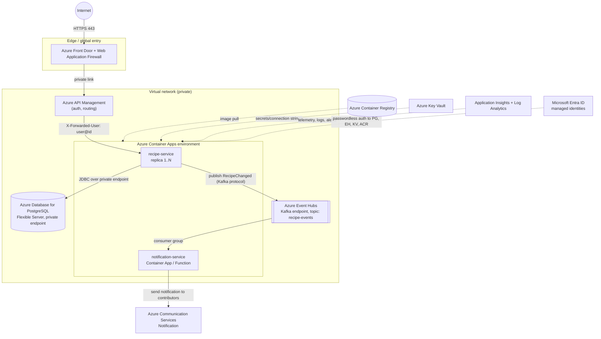
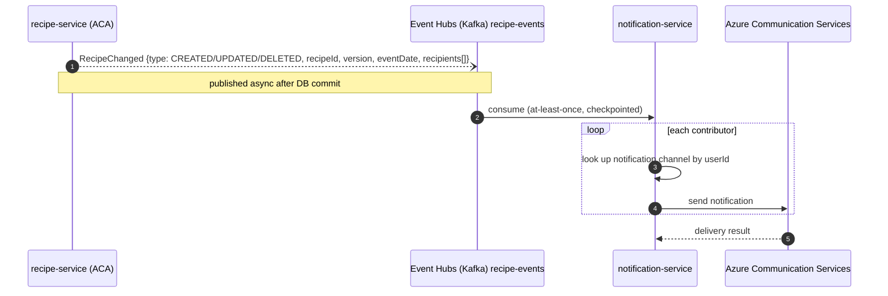

# Recipe Service - Azure Deployment

How the application would be deployed to Azure and opened to internet traffic, including the
notification service that informs all contributors of a recipe about changes.

## Architecture

## Components

| Component | Why                                                                                                                                                                                                               |
|---|-------------------------------------------------------------------------------------------------------------------------------------------------------------------------------------------------------------------|
| **Azure Front Door (Standard/Premium) + Web Application Firewall (WAF)** | Single global HTTPS entry point: handling TLS termination, certificates, DDoS protection, firewall rules etc.                                                                                                     |
| **Azure API Management** | API gateway for authentication, authorization, and request routing. Validates caller identity (e.g., via Microsoft Entra ID) and forwards the authenticated user's id in the `X-Forwarded-User` header to the recipe service. The recipe service trusts this header; security is the gateway's responsibility. |
| **Azure Container Apps** | The service is a stateless container in Azure Container Apps (autoscaling, revisions, blue-green traffic splitting).                                                                                              |
| **Azure Container Registry** | Private registry for docker image built by CI; vulnerability scanning (Defender for Cloud).                                                                                                                       |
| **Azure Database for PostgreSQL - Flexible Server** | Managed Postgres matching the local/dev stack (Flyway migrations run unchanged). Zone-redundant high availability, automated backups, private endpoint only. Entra-integrated authentication removes DB passwords. |
| **Azure Event Hubs (Kafka endpoint)** | Managed, Kafka-compatible event broker.                                                                                                                                                                           |
| **Azure Key Vault** | Any secrets with rotation; referenced by Azure Container Apps, access via managed identity.                                                             |
| **Managed identities (Entra ID)** | Passwordless authentication from the app to Postgres, Event Hubs, Key Vault and ACR.                                                                                  |
| **Application Insights + Log Analytics** | Distributed tracing, request/dependency metrics, log aggregation, alerting.                                          |
| **Virtual Network + private endpoints** | All internal traffic (app ↔ DB ↔ Event Hubs) stays private; only Front Door is internet-facing.                                                                                                                   |

## API Gateway & authentication flow

Authentication and authorization are enforced by the **API Management gateway** (deployed in front of
the recipe service), not by the service itself. The flow is:

1. Client (user) sends a request to the gateway with credentials (e.g., OAuth 2.0 bearer token, 
   certificate, or implicit identity if in a corporate network).
2. The gateway validates the credentials against **Microsoft Entra ID** (or another configured
   identity provider) and extracts the authenticated user's id.
3. The gateway forwards the request to the recipe service with an `X-Forwarded-User` header 
   containing the user id (e.g., `X-Forwarded-User: alice@example.com`).
4. The recipe service **trusts** this header and uses it as the source of truth for the caller's
   identity. No credential validation happens in the service.

This delegation keeps the recipe service stateless and focused on business logic, while the gateway
(a managed, enterprise-grade component) handles the complexity of credential validation, token
refresh, policy enforcement and audit logging.

## Notification service

The proposed solution accommodates notifications to **all contributors of a recipe**
(the creator plus everyone who updated it) in an asynchronous, decoupled way:

1. On every create/update/delete the recipe service publishes a `RecipeChanged` event (with
   type `CREATED`, `UPDATED` or `DELETED`) to the Kafka topic
   `recipe-events`, after the database transaction commits. In Azure this topic lives on
   Azure Event Hubs with the Kafka endpoint enabled.
2. A notification service (small Container App or Azure Function) consumes the topic; 
   the event's `recipients[]` carries user ids, not addresses, so for each recipient the service looks up 
   the notification channel, contact details and per-user preferences by user id, then sends the actual notifications 
   via Azure Communication Services (email / sms / push notification).
3. The broker provides buffering, consumer-side retries and checkpointing/back-pressure, so a
   slow or failing notification channel can never impact the recipe API - the same guarantee
   the current code provides by publishing asynchronously after commit and logging (not
   propagating) publish failures.

